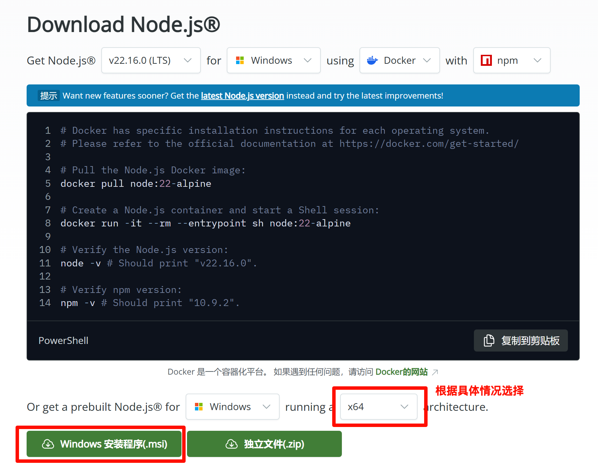

# 帮助文档

## 前置要求
Windows 7 或更新

## 系统依赖项

### Microsoft C++ 生成工具
1. 下载 [Microsoft C++ 生成工具](https://visualstudio.microsoft.com/zh-hans/visual-cpp-build-tools/) 安装程序并打开它以开始安装。
2. 在安装过程中，选中“使用 C++ 的桌面开发”选项。

### WebView2
> WebView 2 已安装在 Windows 10 （从版本 1803 开始）和更高版本的 Windows 上，满足条件的可以跳过此步骤。

通过访问[下载 WebView2 运行时](https://developer.microsoft.com/zh-cn/microsoft-edge/webview2/#download)安装 WebView2。下载并安装“常青独立安装程序（Evergreen Bootstrapper）”。

## 安装 Rust
前往 [https://www.rust-lang.org/zh-CN/tools/install](https://www.rust-lang.org/zh-CN/tools/install) 下载安装 `rustup-init.exe`。

启动 `rustup-init.exe` 后，若显示以下内容：
```text
Current installation options:

   default host triple: x86_64-pc-windows-msvc // 或者 `aarch64-pc-windows-msvc`、`i686-pc-windows-msvc` （根据系统架构而定）
     default toolchain: stable (default)
               profile: default
  modify PATH variable: yes

1) Proceed with standard installation (default - just press enter)
2) Customize installation
3) Cancel installation
>
```
直接按回车 `enter ↩︎` 即可。如果不是，可以按回车安装完成后运行以下命令确保安装正确的工具链：
```bash
rustup default stable-msvc
```

## 安装 Node.js
1. 访问 [Node.js 网站](https://nodejs.org/zh-cn/download)，下载并安装长期支持版本（LTS）的 Windows 安装程序（.msi）。


2. 在终端（以管理员身份运行）运行 `corepack enable` 启用其他包管理器。

3. 使用 `yarn` 作为包管理器。在终端运行 `yarn --version` 出现
```bash
>yarn --version
! Corepack is about to download https://registry.yarnpkg.com/yarn/-/yarn-1.22.22.tgz
? Do you want to continue? [Y/n]
```
按回车。

## 下载 Demo 程序并运行
```bash
git clone https://github.com/tangxiangong/tauri-demo.git
cd tauri-demo
```
在 https://account.mapbox.com/ 获取你的免费访问令牌，并将其添加到环境变量 `VITE_MAPBOX_ACCESS_TOKEN` 中，或者在项目根目录下新建 `.env` 文件，内容为：
```env
VITE_MAPBOX_ACCESS_TOKEN=你的 token
```
```bash
yarn 
yarn install
yarn tauri dev
```